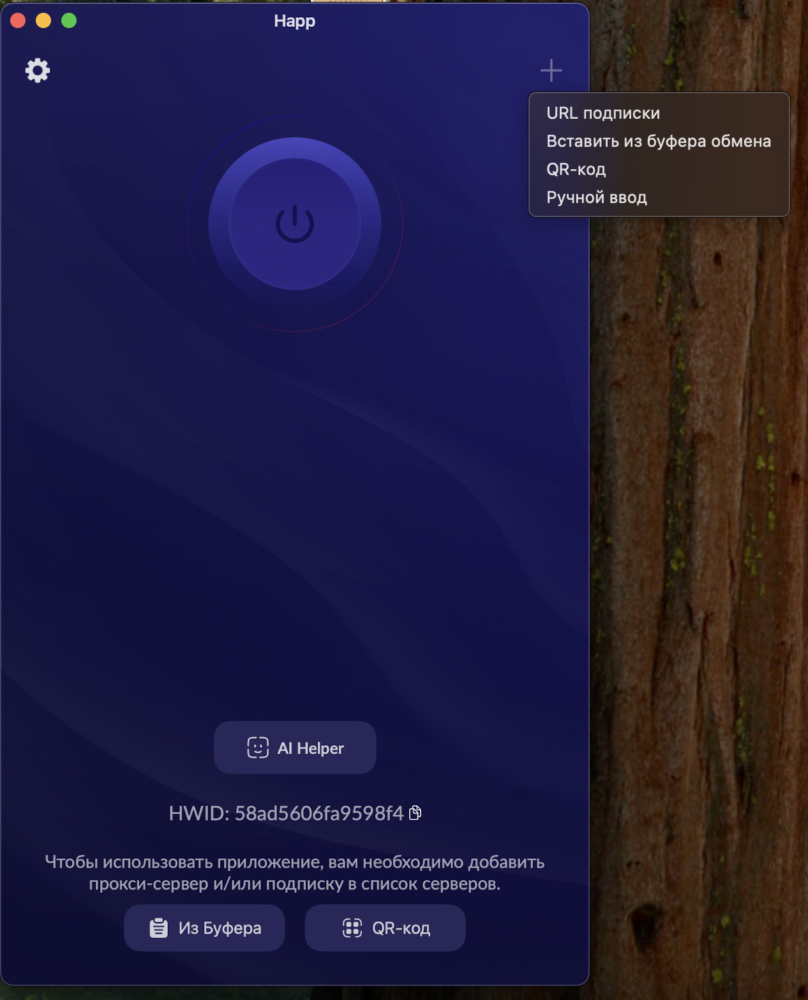
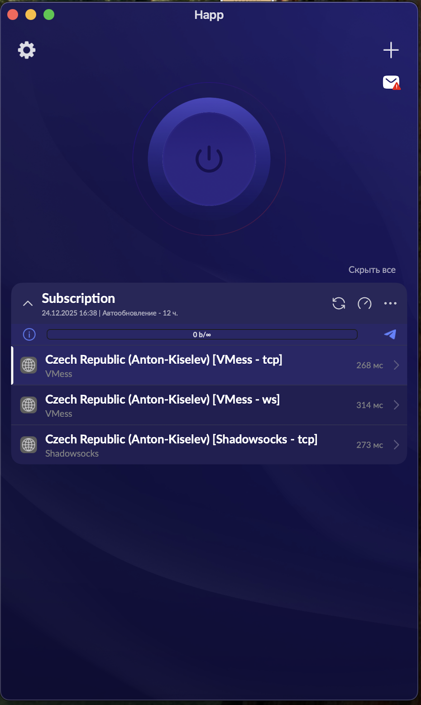
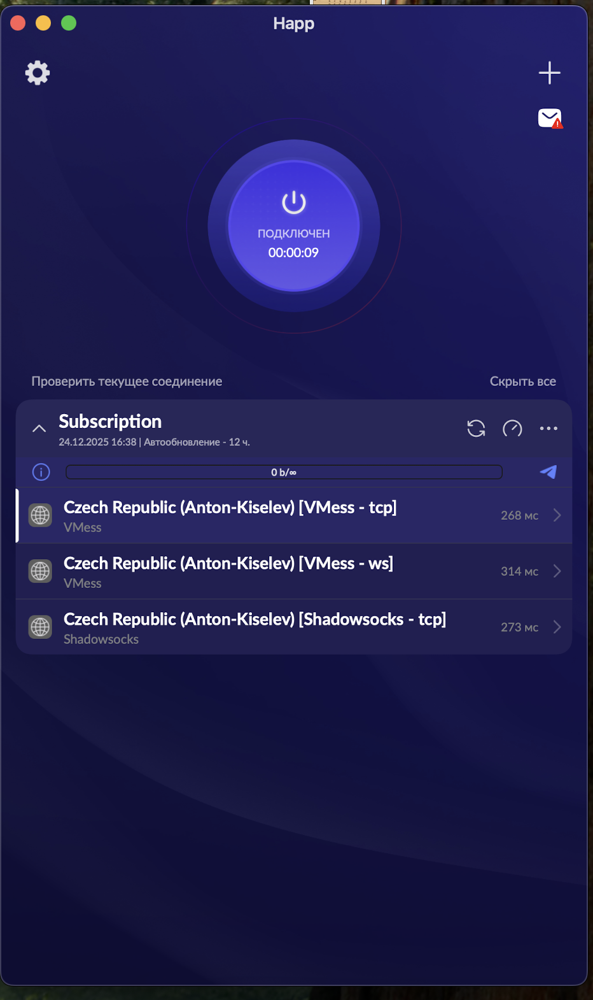
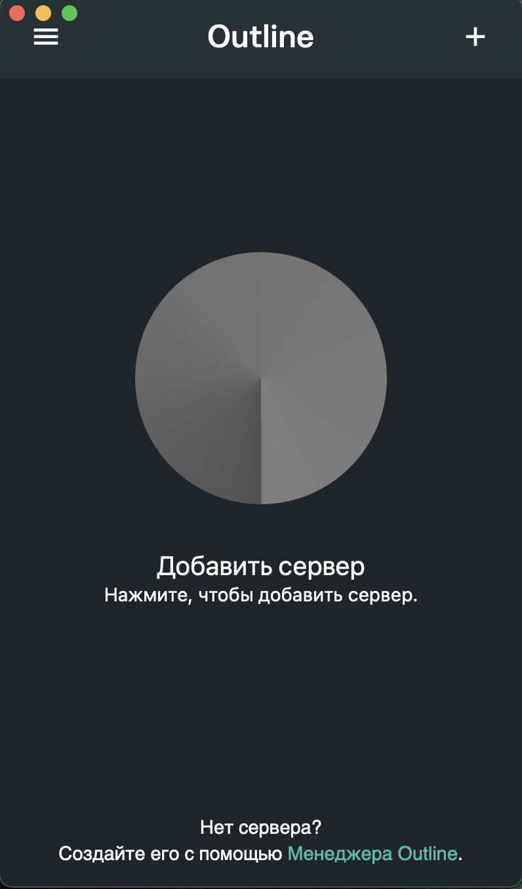
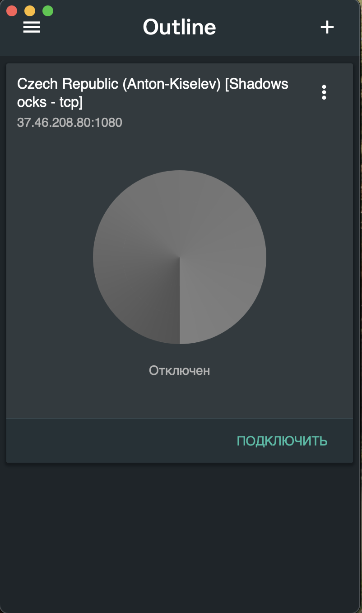

Добрый день.
Для вас доступны два профиля подключения: Shadowsocks и VMess. На данный момент оба профиля работают стабильно.

💻 Десктоп

Для компьютера рекомендую приложение Outline, которое работает с протоколом Shadowsocks (SS).
Другие протоколы приложение не поддерживает.

Скачать можно по ссылке (внизу страницы):
https://getoutline.org/intl/ru/get-started/#step-3

📱 Мобильные устройства

Если используется мобильная сеть, лучше выбрать приложение Happ и протокол VMess
(также поддерживает Shadowsocks).

Скачать можно здесь:
https://www.happ.su/main/ru

Если вам привычны другие приложения с поддержкой VMess, вы можете использовать их — логика добавления ключей у большинства клиентов схожа.

➕ Добавление профиля

Оба приложения интуитивно понятны.
В правом верхнем углу нажмите «+» и выберите «Добавить из буфера обмена».

В личном кабинете напротив вашего имени доступны два столбца:

VMess

Outline / Shadowsocks

Ссылку из столбца VMess вставьте в приложение Happ,
а ссылку из столбца Outline / Shadowsocks — в приложение Outline.

